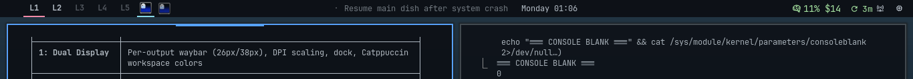
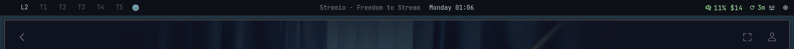
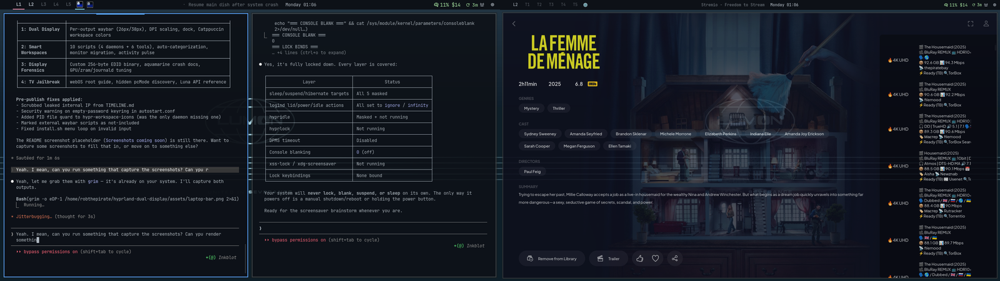

[](LICENSE)
[](https://wiki.hyprland.org/)
[](https://archlinux.org/)
[](https://python.org/)
[](https://claude.ai/code)

# Hyprland Dual Display

A production-tested, four-layer dual-display system for Hyprland. Built on a resource-constrained Samsung laptop (Intel HD 4400, 8GB RAM) driving both a 768p laptop panel and a 1080p LG TV over HDMI, with smart workspace automation, custom EDID firmware, and a jailbroken TV.

Each layer stands on its own. Use what you need.

> **Layer 1** Dual-display Hyprland config with per-output waybar
> **Layer 2** Smart workspace daemons that auto-sort windows across 10 workspaces
> **Layer 3** EDID surgery, GPU tuning, and crash forensics for stubborn displays
> **Layer 4** webOS TV jailbreak with hidden Luna API settings for zero-lag PC mode

<!-- screenshots -->
<p align="center">
  <strong>Laptop (eDP-1, 768p, 26px bar)</strong><br>
  
</p>
<p align="center">
  <strong>TV (HDMI-A-1, 1080p, 38px bar)</strong><br>
  
</p>
<p align="center">
  
</p>

---

## Table of Contents

- [Layer 1: Dual Display Setup](#layer-1-dual-display-setup)
- [Layer 2: Smart Workspace System](#layer-2-smart-workspace-system)
- [Layer 3: Display Forensics](#layer-3-display-forensics)
- [Layer 4: TV Jailbreak](#layer-4-tv-jailbreak)
- [The Full Story](#the-full-story)
- [Installation](#installation)
- [Repository Structure](#repository-structure)
- [Lessons Learned](#lessons-learned)
- [Credits](#credits)

---

## Layer 1: Dual Display Setup

**For anyone** running two monitors on Hyprland. No exotic hardware required.

### What you get

- **Per-output waybar** with different sizing: 26px on the laptop, 38px on the TV (JSON array config)
- **Catppuccin-colored workspace buttons** with per-position tinting (pink, peach, green, blue, mauve)
- **DPI-based scaling** instead of fractional scaling (zero blur on mixed-resolution setups)
- **Optimized compositor settings**: blur disabled, fast animations (1-3ms), direct scanout for fullscreen apps
- **Auto-hide dock** on the laptop bottom edge via nwg-dock-hyprland

### Key configs

| File | Purpose |
|------|---------|
| [`hyprland/monitors.conf`](hyprland/monitors.conf) | Dual-display layout (`auto-left` positioning) |
| [`hyprland/envs.conf`](hyprland/envs.conf) | Integer scales + DPI overrides for GTK/Qt |
| [`hyprland/looknfeel.conf`](hyprland/looknfeel.conf) | Blur off, shadow range, fast animations, direct scanout |
| [`waybar/config.jsonc`](waybar/config.jsonc) | Dual-bar array targeting `eDP-1` and `HDMI-A-1` |
| [`waybar/style.css`](waybar/style.css) | Per-output CSS via `window#waybar.tv *` selector |
| [`waybar/modules.jsonc`](waybar/modules.jsonc) | 20+ module definitions (clock, media, pomodoro, AI usage) |

### How it works

Waybar supports a JSON array at the top level of `config.jsonc`. Each object targets a specific output via the `"output"` key, and the `"name"` field becomes a CSS class on the bar window:

```jsonc
[
  { "name": "laptop", "output": "eDP-1", "height": 26, ... },
  { "name": "tv",     "output": "HDMI-A-1", "height": 38, ... }
]
```

Then in CSS: `window#waybar.tv * { font-size: 15px; }` scales up just the TV bar.

---

## Layer 2: Smart Workspace System

**For Hyprland users** who want intelligent window management across multiple monitors.

### What you get

- **10 workspaces** split across two monitors (5 each) via the [`split-monitor-workspaces`](https://github.com/Duckonaut/split-monitor-workspaces) plugin
- **Auto-categorization daemon** that routes new windows to the right workspace based on keyword matching on class/title
- **Monitor handler** that migrates windows when HDMI connects/disconnects, restoring layout on reconnect
- **Activity pulse** that flashes waybar workspace buttons when background windows update
- **Focus mode** (SUPER+F2) and **Zen mode** (SUPER+F3) for distraction-free single-monitor work
- **Pomodoro timer** in waybar, **clipboard history** via rofi, **keybinding cheat sheet**
- **Safe resolution tester** with automatic revert on timeout

### Workspace layout

```
Laptop (eDP-1)          TV (HDMI-A-1)
  L1 = Dev                T1 = Web
  L2 = Chat               T2 = Media
  L3 = Work               T3 = Reference
  L4 = Games              T4 = Files
  L5 = System             T5 = Extra
```

SUPER+1-5 is context-dependent on the focused monitor. When the TV disconnects, workspaces T1-T5 auto-migrate to the laptop. Reconnect and they come back.

### Daemons (4 Python, run via exec-once)

| Script | Lines | Purpose |
|--------|-------|---------|
| [`hypr-smart-workspace`](scripts/daemons/hypr-smart-workspace) | 306 | IPC listener: categorizes new windows by keyword matching, caches learned decisions |
| [`hypr-monitor-handler`](scripts/daemons/hypr-monitor-handler) | 158 | IPC listener: saves layout on HDMI disconnect, restores on reconnect |
| [`hypr-activity-pulse`](scripts/daemons/hypr-activity-pulse) | 158 | IPC listener: flashes workspace buttons via temporary rename on background activity |
| [`hypr-workspace-icons`](scripts/daemons/hypr-workspace-icons) | 191 | IPC listener: renames workspaces to Nerd Font icons based on open apps |

### Tools (6 Bash/Python, user-triggered)

| Script | Keybinding | Purpose |
|--------|-----------|---------|
| [`hypr-zen-mode`](scripts/tools/hypr-zen-mode) | SUPER+F3 | Zero-chrome fullscreen: 0px borders/gaps, disable other monitor |
| [`hypr-focus-mode`](scripts/tools/hypr-focus-mode) | SUPER+F2 | Fullscreen + disable secondary monitor |
| [`hypr-cheatsheet`](scripts/tools/hypr-cheatsheet) | SUPER+F1 | Color-coded keybinding reference in a floating terminal |
| [`hypr-pomodoro`](scripts/tools/hypr-pomodoro) | waybar click | 25-minute countdown with notification, JSON output for waybar |
| [`hypr-reorganize`](scripts/tools/hypr-reorganize) | SUPER+SHIFT+F1 | One-shot: re-sort all open windows into correct workspaces |
| [`hypr-test-resolution`](scripts/tools/hypr-test-resolution) | manual | Test a resolution with auto-revert on timeout (like xrandr --auto) |

### Smart categorization

The daemon matches window `class` and `title` against keyword lists per workspace category. 130+ keywords across 9 categories cover terminals, browsers, chat apps, media players, file managers, and more. Unknown apps stay where they are; if you manually move a window, the daemon caches that decision for instant recall next time.

Full keybinding reference: [`docs/KEYBINDINGS.md`](docs/KEYBINDINGS.md)

---

## Layer 3: Display Forensics

**For anyone** fighting display issues on Linux: wrong resolution, EDID bugs, GPU crashes, or stubborn HDMI connections.

### The crash (aquamarine UAF)

We woke up to a crash loop: 6 boots, 2 hard crashes overnight. `hypridle` triggered DPMS-off on the TV, which called `SDRMConnector::disconnect()` in aquamarine. But `CLogger` had already been destroyed. Use-after-free, `SIGSEGV`.

**Fix**: Rebuilt aquamarine from `main` (commit `e926559`, includes [PR #244](https://github.com/hyprwm/aquamarine/pull/244)). Pinned in pacman `IgnorePkg` to prevent regression.

### The EDID: four smoking guns

We dumped the TV's EDID and found it was lying:

| # | What's wrong | Impact |
|---|-------------|--------|
| 1 | DTD 1 (preferred) is **1360x768**, not 1920x1080 | Linux always starts at 768p |
| 2 | Native flag on VIC 19 (**720p@50Hz**) instead of VIC 16 | Wrong mode used as tiebreaker |
| 3 | 1080p timing buried in **DTD 6** (last position) | Mode-switch triggers aquamarine atomic bug |
| 4 | TMDS max **150 MHz** (1.5 MHz headroom for 148.5 MHz 1080p) | Some drivers reject marginal timings |

Compared against 815 entries in the [linuxhw/EDID](https://github.com/linuxhw/EDID) community database. Our TV was the outlier. Even a 2010 LG TV reports 1080p preferred.

### The custom EDID

Built a 256-byte binary that fixes all four issues. Deployed via kernel firmware override, baked into the initramfs. TV now boots directly into 1080p from the first frame. **Zero bricking risk**: the TV's EEPROM is never touched.

```bash
# Kernel cmdline
drm.edid_firmware=HDMI-A-1:edid/lg-tv-1080p.bin
```

Full analysis, community comparison, hex reference, and deployment guide: [`edid/README.md`](edid/README.md)

### System-level configs

| File | Purpose |
|------|---------|
| [`system/tmpfiles.d/gpu-min-freq.conf`](system/tmpfiles.d/gpu-min-freq.conf) | Pin Intel GPU min frequency to 600 MHz |
| [`system/sysctl.d/90-zram-tuning.conf`](system/sysctl.d/90-zram-tuning.conf) | zram VM tunables: swappiness=150, page-cluster=0 |
| [`system/systemd/resilient.conf`](system/systemd/resilient.conf) | journald memory limits (prevent crash cascade) |
| [`system/modprobe.d/nvidia.conf`](system/modprobe.d/nvidia.conf) | Blacklist unused NVIDIA GPU (Kepler 710M) |
| [`system/udev/60-ioschedulers.rules`](system/udev/60-ioschedulers.rules) | BFQ scheduler for spinning disks |

Full debugging timeline with kernel traces, dead ends, and breakthrough moments: [`docs/TIMELINE.md`](docs/TIMELINE.md)

---

## Layer 4: TV Jailbreak

**For LG webOS TV owners** using their TV as a PC monitor and wanting zero-lag picture quality.

### The hidden problem

Even with 1080p working and blur disabled, the TV looked terrible. Washed-out text, input lag, smeary motion. We tried GPU-side fixes for days. The actual problem was entirely on the TV.

**The TV was on Sports mode** (not Game mode as we thought). Sports mode runs the full post-processing pipeline:

| Setting | Sports (before) | Game + pcMode (after) | Latency impact |
|---------|-----------------|----------------------|----------------|
| TruMotion | ON | OFF | ~30ms |
| dynamicContrast | high | off | backlight flicker |
| edgeEnhancer | on | off | sharpening halos |
| superResolution | medium | off | upscaling blur |
| noiseReduction | on | off | temporal lag |
| **Estimated total** | **~60-80ms** | **~10ms** (panel only) | |

### The hidden flag

Setting `pictureMode` to `"game"` wasn't enough. LG TVs have a **hidden `pcMode` flag** not exposed in the TV menus. Without it, Game mode still leaves `edgeEnhancer` and `superResolution` enabled. It must be set per-HDMI-port:

```bash
# Enable on ALL ports (avoid port confusion when switching DRM modes)
luna-send -n 1 'luna://com.webos.settingsservice/setSystemSettings' \
  '{"category":"picture","settings":{"pcMode":{"hdmi1":true,"hdmi2":true}}}'
```

### The port confusion

We set `pcMode` on HDMI 1. Quality regressed. Turns out the TV was on HDMI 2. Switching from legacy DRM to atomic DRM changed the AVI InfoFrames, causing the TV to re-evaluate its port mapping. **Always set pcMode on ALL ports.**

Full jailbreak guide with Luna API reference: [`docs/TV-JAILBREAK.md`](docs/TV-JAILBREAK.md)

---

## The Full Story

The layers above are the result. Here's how it unfolded across three sessions in April 2026:

| Phase | Date | What happened |
|-------|------|---------------|
| Crash loop | Apr 4 | 6 boots, 2 hard crashes. Aquamarine UAF + journald memory cascade |
| 1080p quest | Apr 4 | TV stuck at 768p. EDID analysis, atomic DRM bug, temporary workaround |
| EDID deep dive | Apr 4 | Dumped EDID, found 4 defects, compared against 815 community entries |
| Workspace build | Apr 4 | Built 10 scripts, dual waybar, split-monitor workspaces |
| Rendering tuning | Apr 4 | Disabled blur, pinned GPU freq, tried font rendering (dead end) |
| TV jailbreak | Apr 5 | Root shell, discovered Sports mode, found hidden pcMode flag |
| Custom EDID | Apr 5 | Built and deployed 256-byte firmware override |
| Final cleanup | Apr 5 | Removed all DRM workarounds. Clean boot, zero hacks |

For the blow-by-blow technical narrative: [`docs/TIMELINE.md`](docs/TIMELINE.md)

---

## Installation

### Quick start (interactive installer)

```bash
git clone https://github.com/robertogogoni/hyprland-dual-display.git
cd hyprland-dual-display
./install.sh
```

The installer lets you pick which layers to install:

```
[1] Scripts      Copy workspace daemons + tools to ~/.local/bin/
[2] Hyprland     Copy dual-display configs to ~/.config/hypr/
[3] Waybar       Copy dual-bar config + styling to ~/.config/waybar/
[4] System       Deploy GPU/swap/journald configs to /etc/ (needs sudo)
[5] EDID         Deploy custom EDID firmware (needs sudo + reboot)
[6] Plugin       Install split-monitor-workspaces via hyprpm
```

Each module backs up existing files before overwriting.

### Manual installation

<details>
<summary>Click to expand manual steps</summary>

```bash
# Layer 2: Scripts
cp scripts/daemons/* scripts/tools/* ~/.local/bin/
chmod +x ~/.local/bin/hypr-*

# Layer 1: Hyprland configs
cp hyprland/*.conf ~/.config/hypr/

# Layer 1: Waybar configs
cp waybar/config.jsonc waybar/modules.jsonc waybar/style.css ~/.config/waybar/

# Layer 2: Plugin
hyprpm add https://github.com/Duckonaut/split-monitor-workspaces
hyprpm enable split-monitor-workspaces

# Layer 3: System configs (requires root)
sudo cp system/tmpfiles.d/gpu-min-freq.conf /etc/tmpfiles.d/
sudo cp system/sysctl.d/90-zram-tuning.conf /etc/sysctl.d/
sudo mkdir -p /etc/systemd/journald.conf.d
sudo cp system/systemd/resilient.conf /etc/systemd/journald.conf.d/

# Layer 3: EDID override (requires root + reboot)
sudo mkdir -p /usr/lib/firmware/edid
sudo cp edid/lg-tv-1080p.bin /usr/lib/firmware/edid/
# Then add to mkinitcpio.conf FILES and kernel cmdline (see edid/README.md)
```

</details>

### Requirements

| Package | Layer | Purpose |
|---------|-------|---------|
| [Omarchy](https://omarchy.com) (optional) | 1 | Base config framework. `hyprland.conf` sources Omarchy defaults for bindings, autostart, and theming. Remove those lines if using stock Hyprland. |
| Hyprland 0.54+ | 1 | Compositor |
| waybar | 1 | Status bar |
| Python 3 | 2 | Daemon scripts |
| split-monitor-workspaces (hyprpm) | 2 | Per-monitor workspace split |
| Pyprland | 2 | Scratchpads, magnify, monitor shift |
| rofi, cliphist | 2 | Clipboard history |
| grim, slurp, swappy | 2 | Screenshot + annotate |
| playerctl | 1 | Now-playing waybar module |
| nwg-dock-hyprland | 1 | Auto-hide dock |
| edid-decode | 3 | EDID validation |

---

## Repository Structure

```
hyprland-dual-display/
  edid/                          Layer 3: EDID firmware
    lg-tv-1080p.bin                Custom 256-byte EDID binary
    README.md                      Analysis, community comparison, deployment
  hyprland/                      Layer 1: Compositor configs
    hyprland.conf                  Main config (source chain)
    monitors.conf                  Dual-display layout
    envs.conf                      DPI scaling, driver vars
    workspaces.conf                Split-monitor workspace layout
    plugins.conf                   Plugin config
    looknfeel.conf                 Render optimizations
    autostart.conf                 Daemon launches
    bindings-pyprland.conf         Custom keybindings
    workspace-window-rules.conf    Utility window rules
  waybar/                        Layer 1: Status bar
    config.jsonc                   Dual-bar array
    modules.jsonc                  20+ module definitions
    style.css                      Per-output CSS
  scripts/                       Layer 2: Automation
    daemons/                       4 Python IPC daemons
    tools/                         6 Bash/Python utilities
  system/                        Layer 3: System configs
    modprobe.d/                    GPU driver blacklist
    tmpfiles.d/                    GPU frequency pinning
    sysctl.d/                      VM tunables
    systemd/                       journald limits
    udev/                          I/O scheduler
  dock/                          Layer 1: App dock
    pinned.txt                     Pinned apps
    style.css                      Dock styling
  docs/                          All layers: Documentation
    TIMELINE.md                    Full debugging narrative
    TV-JAILBREAK.md                Layer 4: webOS guide
    KEYBINDINGS.md                 Layer 2: Keybinding reference
```

---

## Lessons Learned

### Layer 1
- **DPI-based scaling beats fractional scaling.** `QT_WAYLAND_FORCE_DPI=80` renders at native resolution with smaller widgets. `QT_SCALE_FACTOR=0.75` resamples the buffer. One is sharp, the other is blurry.

### Layer 2
- **Keyword matching > window rules.** Static `windowrulev2` can't handle unknown apps. A daemon with keyword matching + learning cache catches everything.

### Layer 3
- **EDID is the root cause more often than you think.** If your display refuses a resolution, dump and decode the EDID before assuming GPU or compositor bugs.
- **Atomic DRM test-commit can fail with correct mode data.** If the compositor sends stale plane dimensions, the kernel rejects a valid mode. Custom EDID that makes the target mode "preferred" avoids the mode-switch entirely.
- **zram swappiness should be 150+, not 60.** On RAM-constrained systems with zram, higher swappiness tells the kernel to prefer compressing (fast) over evicting file cache (slow disk reads).

### Layer 4
- **TV "Game mode" is not enough.** Many LG TVs have a hidden `pcMode` flag. Without it, even Game mode leaves sharpening filters on.
- **Font rendering: don't use subpixel on TV panels.** TV panels have non-standard subpixel layouts. Grayscale antialiasing looks better than RGB subpixel at any PPI.
- **Always set pcMode on ALL HDMI ports.** AVI InfoFrame changes can make the TV re-evaluate its port mapping.

---

## Key Numbers

| Metric | Value |
|--------|-------|
| Custom scripts | 10 (1,261 lines) |
| Config files | 15+ |
| Custom EDID | 256 bytes, 7 modifications |
| Bugs diagnosed | 5 (UAF crash, memory cascade, EDID defects, atomic DRM, TV picture mode) |
| Upstream issues | [aquamarine#244](https://github.com/hyprwm/aquamarine/pull/244), [#59](https://github.com/hyprwm/aquamarine/issues/59), [hyprland#6953](https://github.com/hyprwm/Hyprland/issues/6953), [#8758](https://github.com/hyprwm/Hyprland/issues/8758) |
| Workspace categories | 10 across 2 monitors |
| Total pixels driven | 3.1M at 60fps on Intel HD 4400 |

---

## License

[MIT](LICENSE)

## Credits

Built collaboratively by a human operator and [Claude Code](https://claude.ai/code) (Anthropic) across three sessions in April 2026. The human identified symptoms, provided hardware access, and validated each fix. Claude provided systematic diagnosis, EDID binary analysis, kernel DRM expertise, and wrote the automation scripts.
